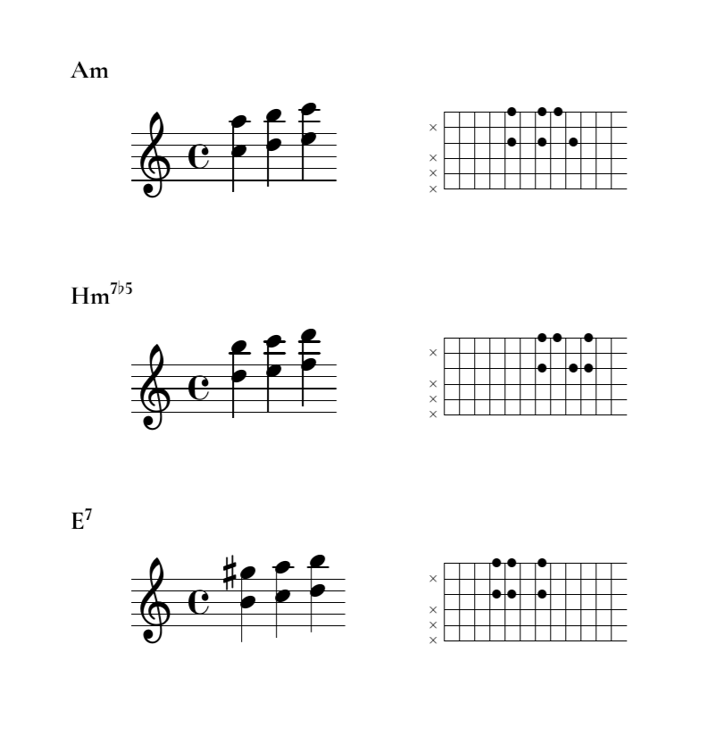

# Арпеджио секстами с промежуточным звеном

## Что это



PDF-файл с примерами того, как обыграть тот или иной аккорд секстами
на гитаре.

## Как собрать новую версию

```bash
make
```

## Что потребуется, чтобы собрать локально

 - [LaTeX](https://www.latex-project.org/)
 - [LilyPond](https://lilypond.org/)

## Как удалить временные файлы

```bash
make clean
```

**ВНИМАНИЕ:** цель `clean` в этом проекте — *очень* агрессивная и удаляет, в частности, все файлы `*.tex` и любые файлы и каталоги, в именах которых ровно два символа. Выполняйте её, только если вы хорошо понимаете, что вы делаете. Авторы не несут ответственности за последствия применения этого `Makefile` в других проектах, особенно не имеющих резервной копии и не хранящихся в системе контроля версий.

## Лицензия

| Какая лицензия                                                                       | На что                               |
|--------------------------------------------------------------------------------------|--------------------------------------|
| [](https://www.gnu.org/licenses/agpl-3.0.html)            | AGPL на всё, что скорее-код.         |
| [](https://creativecommons.org/licenses/by-sa/4.0/) | СС BY-SA на всё, что скорее-контент. |

